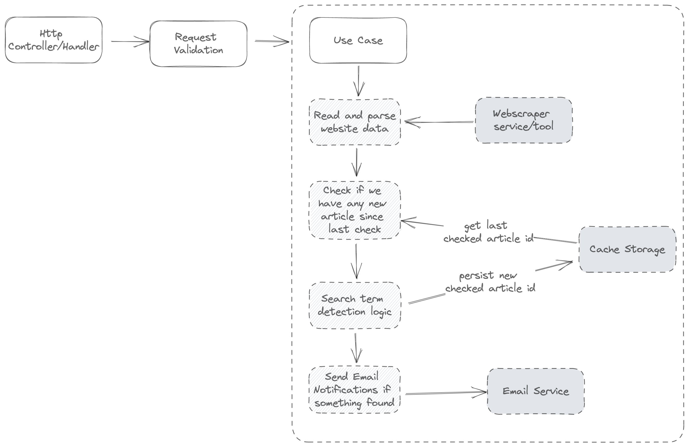

# Websraper Green House API

My wife is checking every week a specific website to check if certain candidatures are already available. This is a very manual and boring task, so I decided to automate it. I will be using a Cron Job to check every week if the candidatures are available, and if so, I will send an email to my wife. It will be running only for a few weeks, after that I will stop it.

## API Endpoints

- `/api/cron/greenhouse` - Web scraper to check if the Green House is already available, if so, it will send a notification. Pass a request parameter `?API_KEY=<your secret>` to authenticate the request.

## Requirements

- Node.js 18.x
- Vercel account + package `vercel` installed globally
- Postmark account

## Tech Stack

- [Vercel](https://vercel.com/) - Serverless Functions
- [Cheerio](https://cheerio.js.org/) - Web scraping (to parse HTML)
- [Vercel Cron Jobs](https://vercel.com/blog/cron-jobs) - Cron jobs (alternatives: AWS CloudWatch Events, qstash, inngest, github actions, etc.)
- [Zod](https://zod.dev) - Type validation for the environment variables
- [NodeMailer](https://nodemailer.com/about/) - Send emails
- [Postmark](https://postmarkapp.com/) - Email service (in combination with NodeMailer)

## Architecture Diagram



## Tecnical Notes

As you can see in the code I'm including as part of the lambda/function the notification mecanism. I'm creating the promises to send the email for each user, and then I'm using `Promise.all` to wait for all the promises to be resolved. This is because I want to send all the emails at the same time, and not one by one. What are the downsides of this approach? Let's see:

- If one of the emails fails, all the emails will fail. I'm not handling this case, but I could do it quickly by using `Promise.allSettled` and then check if there is any email that failed and retry it;
- If the number of users is too big the function will timeout or the third party email service will reject requests (due to some rate limits):
  - I could use dedicated queue system (like AWS SQS, Upstash QStash, ...) to send the emails in batches + retry the failed ones --> Event Driven Architecture!
  - I can send emails in batches (e.g. 10 emails per batch) and then wait for a few seconds before sending the next batch: I can do this by using `Promise.all` and then `setTimeout` to wait for a few seconds before sending the next batch. Or actually wait until it's the previous batch is resolved. To send emails in batch I can use some great packages like `p-queue` or `p-limit`;

## Run Locally

```bash
vercel dev
```

To expose to the API locally to the outside world,
you can use [ngrok](https://ngrok.com/).

## Deploy to production

```bash
vercel deploy --prod
```
